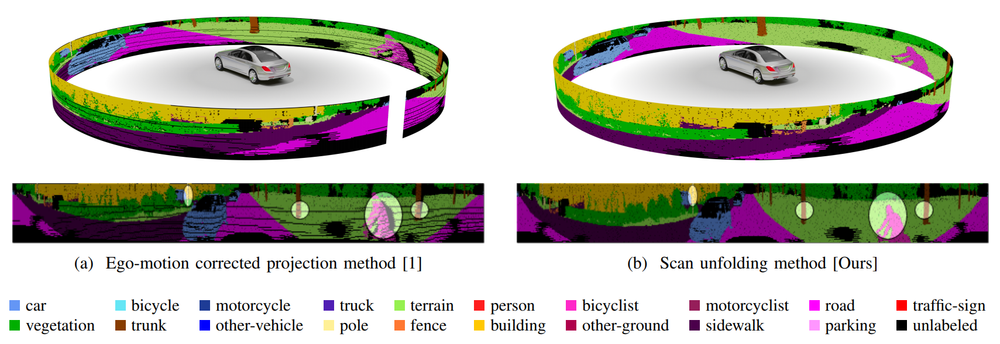
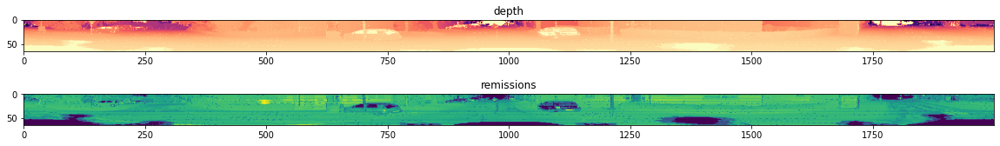

# KITTI Scan Unfolding [](LICENSE)

Python implementation of KITTI scan unfolding.

We propose KITTI scan unfolding in our paper
[Scan-based Semantic Segmentation of LiDAR Point Clouds: An Experimental Study](https://arxiv.org/pdf/2004.11803.pdf).
If you use this code or the algorithm described in the paper, please make sure to [cite](#citation) this paper.


Fig. 1: **Cylindrical point cloud projection**:
(a) Correcting for ego-motion leads to a projection that suffers from systematic
point occlusions as some 3D points are projected into occupied pixels.
Hidden points can not provide any information to the network and may not be accurately classified.
(b) The scan unfolding method provides a dense projection without systematic discretization artifacts.

## Description
A detailed explanation on the scan unfolding is given in our [paper](https://arxiv.org/pdf/2004.11803.pdf).
Here we provide only a brief summary on how to use the code.

The unfolding method is not a general algorithm that can be applied to any LiDAR dataset.
It is rather an engineering trick that can be applied to raw KITTI data and raw KITTI data only.
You may find the raw KITTI dataset [here](http://www.cvlibs.net/datasets/kitti/raw_data.php).
The data exhibits a unique pattern in which the files are created, easing the way to
restore the original internal raw data structure of the sensor, i.e. the sensor view image.

## Installation
Install package `unfolding` directly from GitHub with
```shell script
pip install git+https://github.com/ltriess/kitti_scan_unfolding
```
It only requires `numpy` to run.

## Usage
The package provides three functions.
Two which return the indices for the rows and columns in the image-like projection and
one that can be used to generate the projection directly.
For a comprehensive guide take a look at this [notebook](example.ipynb).

We recommend using the `projection` function directly.
It can unfold all additional channels accordingly to `points`.
```python
import numpy as np
import unfolding

scan = np.fromfile("/path/to/kitti.bin", dtype=np.float32).reshape((-1, 4))
points = scan[:, :3]
remissions = scan[:, 3]

projection = unfolding.projection(points, remissions, image_size=(64, 2000))
proj_points = projection["points"]  # the projected points (64, 2000, 3)
proj_remissions = projection["channels"][0]  # the projected remissions (64, 2000)
```

Fig. 2: **The unfolded scan**:
The top shows the color coded depth values, the bottom are the intensity values.

## License
This project is licensed under the MIT License - see the [LICENSE](LICENSE) for details.

## Citation
When you use this code or the algorithm from the paper, please cite
```
@article{triess2020,
    title={{Scan-based Semantic Segmentation of LiDAR Point Clouds: An Experimental Study}},
    author={Triess, Larissa T. and Peter, David and Rist, Christoph B. and Z\"ollner, J. Marius},
    journal={arxiv},
    year={2020}
}
```

## Links
* [Paper](https://arxiv.org/pdf/2004.11803.pdf)
* [Project page](http://ltriess.github.io/scan-semseg)
* Implementation of SLC layer [[PyTorch](https://github.com/ltriess/torch_semi_local_conv)] [[TensorFlow](https://github.com/ltriess/tf_semi_local_conv)]

## References

[1] A. Milioto et al., “RangeNet++: Fast and Accurate LiDAR Semantic Segmentation,”
in IEEE/RSJ Intl. Conf. on Intelligent Robots and Systems (IROS), 2019.
